

  
  <h1>Frank!Framework</h1>
  
A VS Code extension to help developers build Frank!Framework integrations faster.

---

## Features

### Configuration Flow Visualization

The secondary sidebar automatically opens a live flowchart of the Frank configuration currently open in your editor. It updates on every save and document change, giving you an instant visual overview of your pipeline. Click any node in the flow to jump directly to that pipe or adapter in the editor. Use the zoom controls in the bottom-left corner or the scrollwheel to zoom in, zoom out, or fit the diagram to screen.

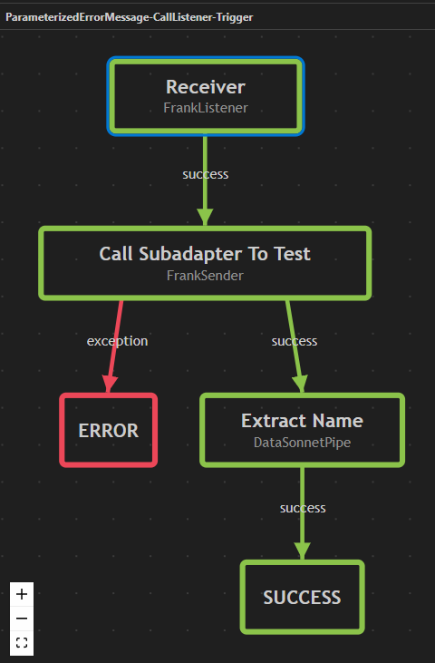

---

### Frank!Framework Wiki Snippets

Snippets from the Frank!Framework Wiki are loaded as global suggestions, organized by component name. Start typing the name of the component you want to insert and select it from the autocomplete list.

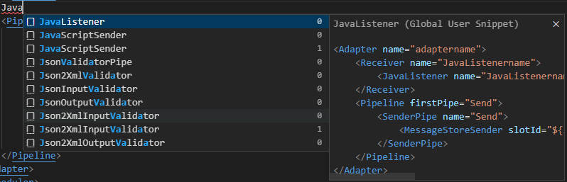

---

### Create Custom Snippets

Select any text in your editor, right-click, and choose **Add Frank! Snippet** to save it as a reusable snippet. Give it a name, or use the name of an existing group to add it to that group.

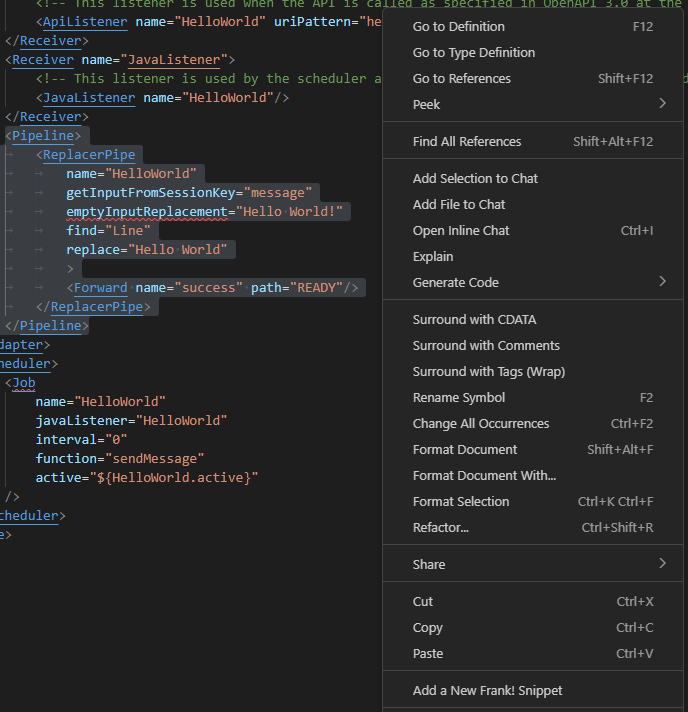

---

### View Snippets

The **Frank!Snippets** view in the Explorer displays a tree of all Frank!Framework Wiki snippets and your own user snippets. Click any snippet to insert it directly into your editor.

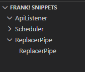

---

### Manage User Snippets

Click a snippet group name in the Frank!Snippets view to open the management panel. From there you can add new snippets to the group, edit existing ones, or delete them. You can also open the corresponding Frank!Framework Wiki file to contribute your snippet upstream.

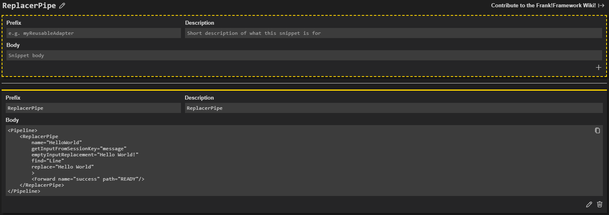

---

### Run a Frank Project

The **Frank!Start** view in the Explorer lets you run a Frank project directly from VS Code. Open any file belonging to a Frank project and use the view to launch it with Ant or Docker Compose. If a `build.xml` or `docker-compose.yml` is missing, the extension offers to add one automatically.

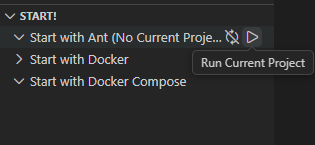

---

### Manage Frank!Framework Version

Right-click a project in the Frank!Start view to manage the Frank!Framework version it runs with. Choose between the latest version, the latest stable version, or a version already installed locally. The current version is displayed next to the project name.

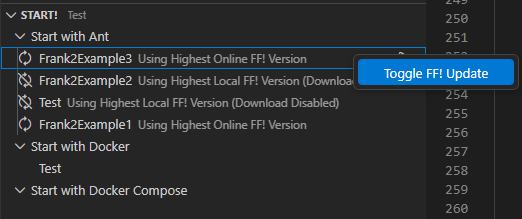

---

### Create a New Frank Project

Click the **+** button in the Frank!Start view header to start creating a new Frank project.

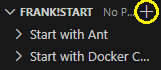

A picker appears where you can choose the project type. Select **Simple Frank** to generate a ready-to-use project structure in your workspace, or select one of the other options to be directed to the relevant documentation.

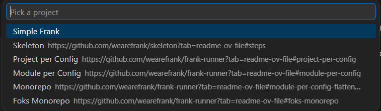

After selecting **Simple Frank**, a form opens where you set the project name, root directory, and one or more configuration names. Check **Generate boilerplate files** to have the extension create starter XSL, XSD, datasource, and JSON schema files in each configuration's subfolders, or leave it unchecked to start with an empty structure.

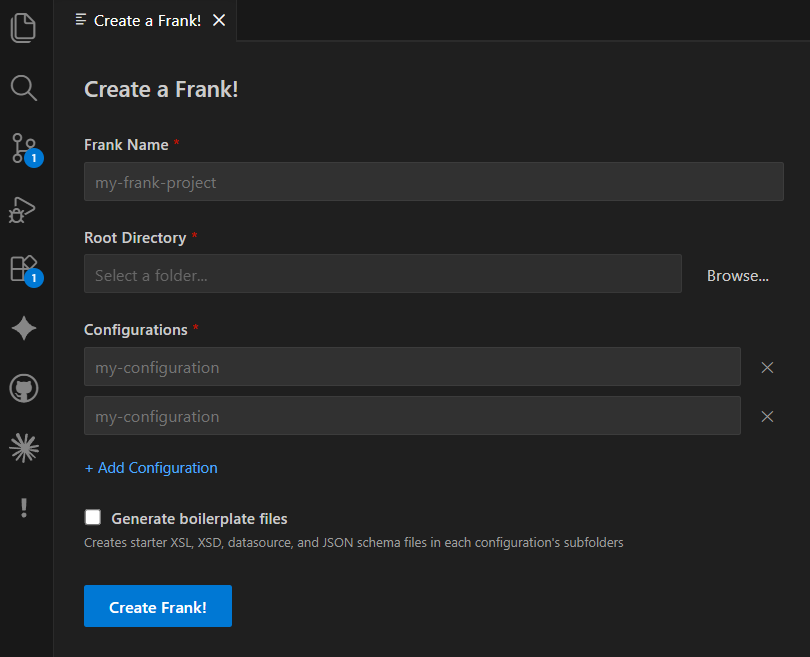

---

### Component Documentation Links

Components in your Frank XML configuration that have a page in Frank!Doc are underlined. `Ctrl`+click any underlined component name to open its documentation page in your browser.

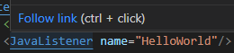

---

### Real-time XML Validation

As you type, the extension validates your Frank XML configuration and reports errors and warnings directly in the editor via VS Code diagnostics. Validation covers pipeline structure, forward definitions, and XPath/JSONPath expressions used in your configuration. Validation runs with a 300ms debounce to stay out of your way while you type.

---

### Navigation: Go-to-Definition, Find References, and Rename

- **Go-to-definition** — `F12` on a `sessionKey` attribute jumps to where that key is stored in the pipeline.
- **Find references** — `Shift+F12` on a pipe name lists every place it is referenced across your configuration files.
- **Rename** — `F2` on a pipe name renames it across the enclosing adapter. `F2` on a session key renames it across the entire workspace.

---

## Requirements

- VS Code `1.109.0` or later
- [Red Hat XML](https://marketplace.visualstudio.com/items?itemName=redhat.vscode-xml) extension — installed automatically as a dependency

---

## Configuration

All features are enabled by default and can be toggled individually in your VS Code settings (`Ctrl`+`,`, search for `frank`). Alternatively you can find them under `Settings` -> `Extensions` -> `Frank!Framework`.

| Setting | Default | Description |
|---|---|---|
| `frank.enableValidation` | `true` | Real-time XML validation with diagnostics |
| `frank.enableFlowVisualization` | `true` | Flow chart in the secondary sidebar |
| `frank.enableSnippets` | `true` | Frank!Framework Wiki snippet suggestions |
| `frank.enableGoToDefinition` | `true` | Go-to-definition for `sessionKey` attributes |
| `frank.enableFindReferences` | `true` | Find references for pipe names |
| `frank.enableRename` | `true` | Rename support for pipe names and session keys |
| `frank.enableDocumentLinks` | `true` | Frank!Doc hyperlinks for component names |

---

## Installation

Search for **Frank!Framework** in the VS Code Extension Marketplace and click **Install**, or install it from the [Marketplace page](https://marketplace.visualstudio.com/items?itemName=wearefrank.frank).

---

## Contributing

Contributions and suggestions are welcome. Visit the [GitHub repository](https://github.com/wearefrank/vscode-plugin) to open an issue.
